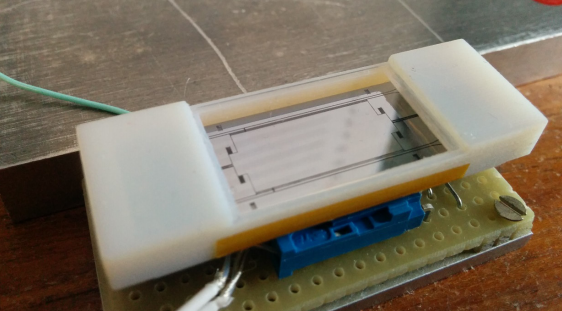

# Control of a MEMS Scanning Mirror for Display Applications
Imperial College London. Electrical and Electronic Engineering. 
Final Year Project. Kishan Amratia

The repository is split into different folders: 

* __MATLAB Files__: Contains all MATLAB scripts and files for the simulation model developed for the project
* __Microcontroller Files__: Contains software for the microcontroller
* __PCB Design Files__: Contains the EAGLE PCB designs and circuit schematics
* __PICOCAP Documents and Config__: Contains the software, documents and configuration files for the PICOCAP capacitance sensor chip
* __Video__: Contains slow motion video capture of the mirror (400fps)

Additional information on how to use these files is provided in the appendix of the final report

